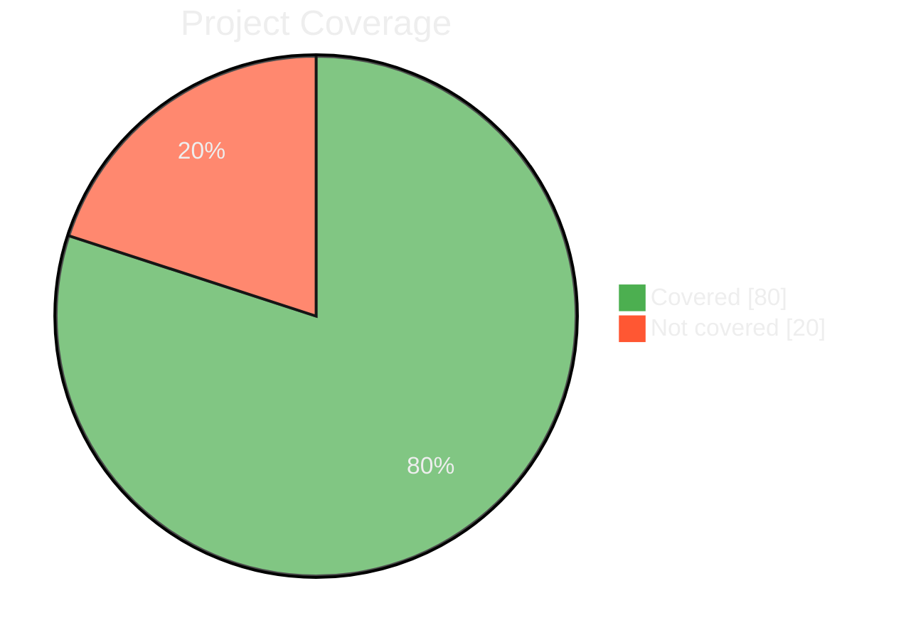

# LCOV Summary Action

[](https://github.com/pre-history/lcov-summary-action/actions/workflows/ci.yml)
[](https://github.com/pre-history/lcov-summary-action/actions/workflows/test-coverage.yml)


This repository contains the code for the LCOV Summary Action, a GitHub Action that provides a summary of Line Coverage (LCOV) reports in your GitHub Pull Requests.



## Features

- Summarizes LCOV reports in GitHub Pull Requests.
- Provides a clear and concise overview of code coverage changes.
- Helps maintain high test coverage by making coverage changes visible in each PR.
- 147 unique randomized feedback messages that progress from roasting low coverage to celebrating high coverage.

## Usage

To use the LCOV Summary Action in your project, add the following to your GitHub Actions workflow file:

```yaml
- name: LCOV Summary
  uses: pre-history/lcov-summary-action@v0.6.0
  with:
    lcov-file: './coverage/lcov.info'
    comment-on-pr: true
    show-coverage-feedback: true
```

## Inputs

| Input Name                  | Description                                                                   | Required | Default Value          |
| --------------------------- | ----------------------------------------------------------------------------- | -------- | ---------------------- |
| `github-token`              | GitHub token                                                                  | NO       | `${{ github.token }}`  |
| `title`                     | Summary title                                                                 | No       | -                      |
| `lcov-file`                 | Path to LCOV file                                                             | No       | `./coverage/lcov.info` |
| `comment-on-pr`             | Add diagram comment to the current PR [Need Permission](#permissions)         | No       | `false`                |
| `working-directory`         | Set working directory if project is not in root folder                        | No       | `./`                   |
| `pie-covered-color`         | Color for pie chart covered part                                              | No       | `#4CAF50`              |
| `pie-not-covered-color`     | Color for pie chart not covered part                                          | No       | `#FF5733`              |
| `coverage-threshold`        | Minimum coverage percentage required (action fails if below)                  | No       | `0` (no enforcement)   |
| `fail-on-coverage-decrease` | Fail if coverage decreases compared to base branch                            | No       | `false`                |
| `show-coverage-feedback`    | Show randomized coverage feedback messages (147 unique roasts/encouragements) | No       | `false`                |

## Coverage Philosophy

**LCovMan is designed to inform, not enforce.** By default, the action provides visibility into coverage without blocking your development workflow:

- **No coverage thresholds** by default (`coverage-threshold: 0`)
- **No failure on coverage decrease** by default (`fail-on-coverage-decrease: false`)
- **Focus on transparency** - Shows coverage changes clearly in PR comments
- **Optional enforcement** - You can enable thresholds if your team prefers strict enforcement

### Examples

**Informational only (default):**

```yaml
- uses: pre-history/lcov-summary-action@latest
  with:
    comment-on-pr: true
    # Uses defaults: no threshold enforcement
```

**With enforcement:**

```yaml
- uses: pre-history/lcov-summary-action@latest
  with:
    comment-on-pr: true
    coverage-threshold: '80' # Require 80% coverage
    fail-on-coverage-decrease: true # Block PRs that decrease coverage
```

## Permissions

The `permissions` section in the GitHub Actions workflow file is used to control the access level of the GitHub token (`GITHUB_TOKEN`) for different scopes. When the `comment-on-pr` input is set to `true` in the LCOV Summary Action, the action will attempt to post a comment on the current pull request with the coverage summary.

In order to do this, the action needs specific permissions:

- `contents: write` allows the action to create, update, and delete repository contents, which is necessary for creating the comment with the coverage summary.
- `pull-requests: write` allows the action to manage pull requests in the repository. This includes creating review comments, which is what the action does when `comment-on-pr` is set to `true`.

Therefore, if you want to use the `comment-on-pr` feature of the LCOV Summary Action, you need to include the following in your workflow file:

```yaml
permissions:
  contents: write
  pull-requests: write
```

This ensures that the action has the necessary permissions to post the coverage summary as a comment on the pull request.

## Coverage Feedback Messages

When `show-coverage-feedback` is enabled, the action displays randomized feedback messages that adapt to your coverage level:

### Coverage Ranges & Message Examples

- **0% Coverage** (21 messages): Savage roasts like "💀 Your code coverage is deader than a doornail!" and "🔮 No tests, only vibes."
- **1-19% Coverage** (21 messages): Critical but motivating feedback such as "🦗 Test results came back and it was just crickets."
- **20-39% Coverage** (21 messages): Encouraging progress with messages like "🌱 A seedling of coverage. Needs more sunshine and effort."
- **40-59% Coverage** (21 messages): Balanced feedback including "🌗 Half moon coverage. We want full moon energy."
- **60-79% Coverage** (21 messages): Positive reinforcement like "🎨 Your test suite is turning into art."
- **80-94% Coverage** (21 messages): High praise such as "🎤 Your test suite just dropped a mic."
- **95-100% Coverage** (21 messages): Pure celebration including "🧼 Code squeaky clean. Mr. Clean is impressed."

Each run randomly selects one message from the appropriate range, ensuring fresh and entertaining feedback every time!
