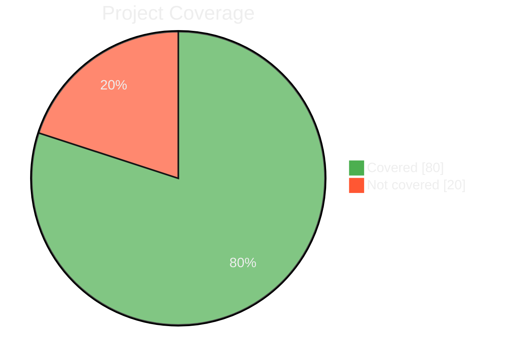

# LCOV Summary Action

[](https://github.com/pre-history/lcov-summary-action/actions/workflows/ci.yml)
[](https://github.com/pre-history/lcov-summary-action/actions/workflows/test-coverage.yml)


This repository contains the code for the LCOV Summary Action, a GitHub Action that provides a summary of Line Coverage (LCOV) reports in your GitHub Pull Requests.



## Features

- Summarizes LCOV reports in GitHub Pull Requests.
- Provides a clear and concise overview of code coverage changes.
- Helps maintain high test coverage by making coverage changes visible in each PR.

## Usage

To use the LCOV Summary Action in your project, add the following to your GitHub Actions workflow file:

```yaml
- name: LCOV Summary
  uses: pre-history/lcov-summary-action@v0.4.1
```

Replace `./path/to/your/lcov.info` with the path to your LCOV report file.

## Inputs

| Input Name              | Description                                                           | Required | Default Value          |
| ----------------------- | --------------------------------------------------------------------- |----------| ---------------------- |
| `github-token`          | GitHub token                                                          | NO       | `${{ github.token }}`  |
| `title`                 | Summary title                                                         | No       | -                      |
| `lcov-file`             | Path to LCOV file                                                     | No       | `./coverage/lcov.info` |
| `comment-on-pr`         | Add diagram comment to the current PR [Need Permission](#permissions) | No       | `false`                |
| `working-directory`     | Set working directory if project is not in root folder                | No       | `./`                   |
| `pie-covered-color`     | Color for pie chart covered part                                      | No       | `#4CAF50`              |
| `pie-not-covered-color` | Color for pie chart not covered part                                  | No       | `#FF5733`              |

## Permissions

The `permissions` section in the GitHub Actions workflow file is used to control the access level of the GitHub token (`GITHUB_TOKEN`) for different scopes. When the `comment-on-pr` input is set to `true` in the LCOV Summary Action, the action will attempt to post a comment on the current pull request with the coverage summary.

In order to do this, the action needs specific permissions:

- `contents: write` allows the action to create, update, and delete repository contents, which is necessary for creating the comment with the coverage summary.
- `pull-requests: write` allows the action to manage pull requests in the repository. This includes creating review comments, which is what the action does when `comment-on-pr` is set to `true`.

Therefore, if you want to use the `comment-on-pr` feature of the LCOV Summary Action, you need to include the following in your workflow file:

```yaml
permissions:
  contents: write
  pull-requests: write
```

This ensures that the action has the necessary permissions to post the coverage summary as a comment on the pull request.
